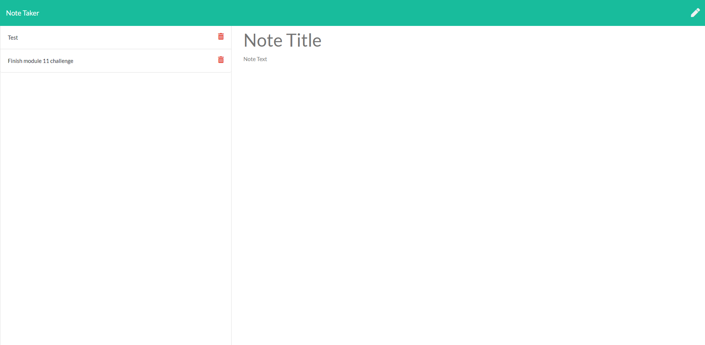

# Note Taker

## Description

This is an express server app for quick note taking, editing and deleting.

  ## Table of Contents

  * [Installation](#installation)
  * [Usage](#usage)
  * [Credits](#credits)
  * [License](#license)
  

  ## Usage

  Deploy the website, click Get Started. When you are at the note taker page you will be able to type in text, save and delete and added items.

## License

## Badges

